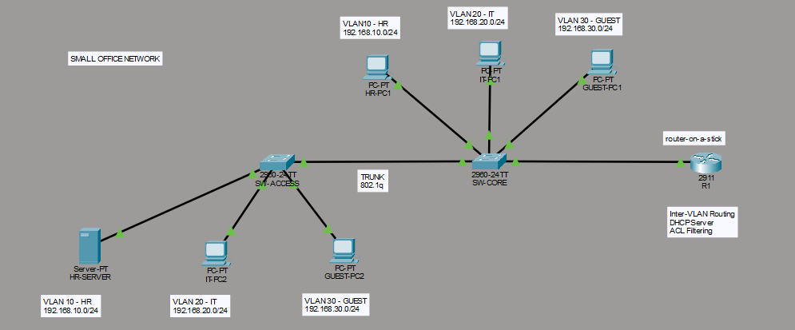

Small Office Network Simulation

Simulasi jaringan kantor kecil menggunakan VLAN segmentation, inter-VLAN routing, DHCP, trunking, dan ACL security menggunakan Cisco Packet Tracer.

Project Overview

Project ini dibuat untuk mensimulasikan infrastruktur jaringan kantor kecil dengan segmentasi antar divisi agar jaringan lebih terstruktur dan aman.

Topologi menggunakan:

1 Router
2 Switch
Multiple VLAN
DHCP Server
ACL Restriction
Network Topology

Tambahkan screenshot topologi kamu nanti di sini.

Contoh:

VLAN Design
VLAN	Department	Network	Gateway
10	HR	192.168.10.0/24	192.168.10.1
20	IT	192.168.20.0/24	192.168.20.1
30	Guest	192.168.30.0/24	192.168.30.1
Features
VLAN segmentation
Inter-VLAN Routing (Router-on-a-Stick)
DHCP configuration
Access & Trunk Port configuration
ACL-based Guest restriction
Static IP Server configuration
Basic network documentation
Device Naming
Device	Name
Router	R1
Core Switch	SW-CORE
Access Switch	SW-ACCESS
HR PC	HR-PC1
IT PCs	IT-PC1, IT-PC2
Guest PCs	GUEST-PC1, GUEST-PC2
Server	HR-SERVER
Technologies Used
VLAN
802.1Q Trunking
Router-on-a-Stick
DHCP
ACL
Static IP Configuration
Cisco IOS CLI
Security Policy

Guest VLAN (VLAN 30) tidak diizinkan mengakses internal VLAN:

VLAN 10 (HR)
VLAN 20 (IT)

ACL diterapkan pada interface VLAN 30 untuk membatasi akses internal.

IP Addressing
Dynamic Host Configuration (DHCP)

Client PC menggunakan DHCP yang dikonfigurasi pada router.

Static IP

HR-SERVER menggunakan static IP:

Device	IP Address
HR-SERVER	192.168.10.10
Verification & Testing
Successful DHCP Assignment
Client berhasil mendapatkan IP sesuai VLAN masing-masing.
Inter-VLAN Routing
VLAN dapat berkomunikasi melalui router.
ACL Restriction
Guest VLAN gagal mengakses VLAN internal sesuai policy.
